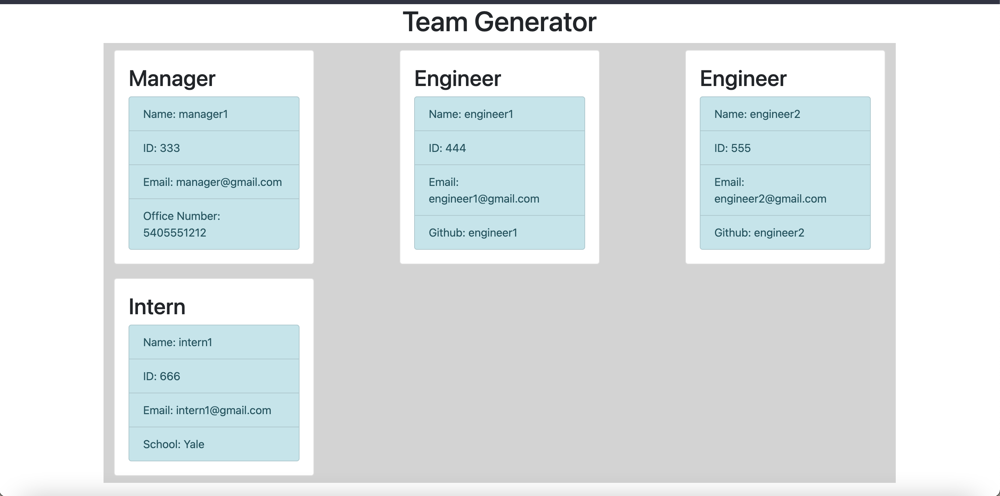

[](https://opensource.org/licenses/MIT)
   # Team-Profile-Generator
   ## Table of contents     
   [description](#description)

[instructions](#instructions)

[usage](#usage)


[contribution](#contribution)

[testing](#testing)

[username](#username)

[email](#email)

[license](#license)

   ## Description
   This applications takes command line input generate data to form a team html page   

   ## Instructions
   Use npm install to install necessary dependencies 

   ## Usage

   ### Menu usage example

   

[](https://asciinema.org/a/5UGfN2qjEe2zE7uiLN4NKaNpC)
    
   
   ### Screenshot of generated html
   
   [

   ## Contribution

   To contribute please fork the repo and create a pull request.
   
   ## Testing instructions
   Testing is done via jest. 
   ```
   npm run test
   ```
   ### Test run showing tests pass

   [](https://asciinema.org/a/pUVerPJNEXh3fxVfMSjC9voTb)

   ## Questions
   ### Email:
   philip741@gmail.com
   ### Username:
   philipbrowning
   ## License
   [License: MIT](https://opensource.org/licenses/MIT)
  